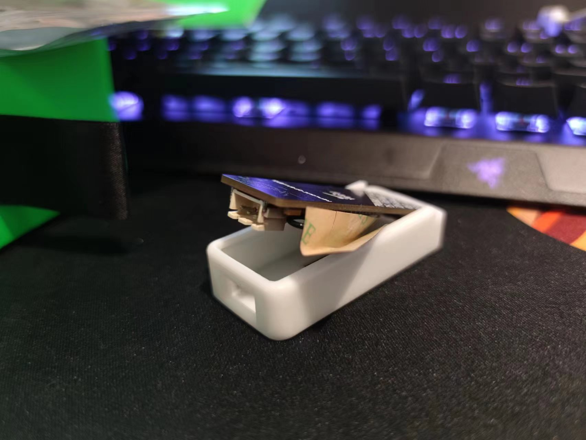

# Dunk 幻彩RGB控制器

[English MarkDown](./README_English.md)

# 设备信息

- ### 主控∶ESP32

- ### 支持灯珠∶WS2812X(系列) 等等....WLED能支持的

- ### 支持电压∶5V(不支持12V)

- ### 支持电流∶5A以内(发热量正常)

- ### 支持线长∶3米以内

- ### 支持灯珠∶144颗/米 (颗数和电流、发热量成正比和电压成反比)

- ### 外壳∶尼龙（质感好）+ 8001高透树脂     ￥30

# 设备固件地址 ✨

[Wled固件安装地址](install.yeely.top)

## 设备预览（看不见图片可能是国内的DNS被污染了，可以代理国外服务器来访问）

# 例子 如何安装天线

#### 对折天线然后将他贴在外壳内侧一同装入

# 更新说明

- [x] 在V3基础上更新了麦克风
- [x] 外壳更新！
- [x] 修复了散热问题
- [x] Dunk-PCB取消元件：BC847BVC-7、12K * 2（不影响自烧录）
- [ ] 点赞过500！开源芯片款

# 💡Tips：

### 1.Dunk版本V5，V6芯片版本还在优化中！.......~~（看情况修改PCB开源）~~ 外形更小更美观

### 2.根据上述我给出的网站进行（汉化）固件安装，仅仅支持ESP8266、ESP32

###  3.如果需要信号良好的，请自己去淘宝进行购买贴片天线，将天线长度进行修改，可塞入外壳内

###  4.如果外壳不喜欢使用散热片进行散热可自己修改外壳模型，使用金属外壳的3D打印可更好（其实无需散热只不过在特殊场景需要大电流，散热可是必不可少了，WLED的限制电流在3000MA以内无需额外添加散热片进行更好的被动散热，正常散热即可）

### 5.麦克风蛮贵的，无这个需求可不需要贴

### 6.若灯珠超过300颗，请用大功率充电头（25W以上）

------

